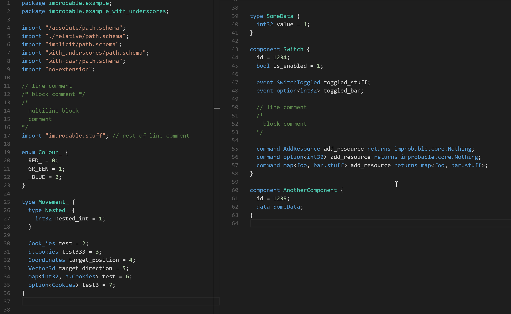
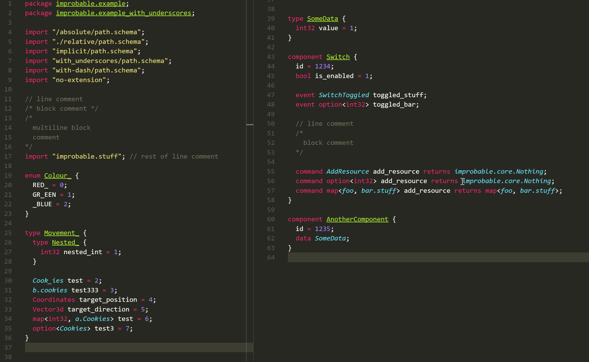

# vscode-schema

Improbable SpatialOS schema language colorizer for Visual Studio Code. Based on `tmLanguage` from sublime extension https://github.com/MorrisonCole/spatialos-schema-sublime.

Dark+:

Monokai:

